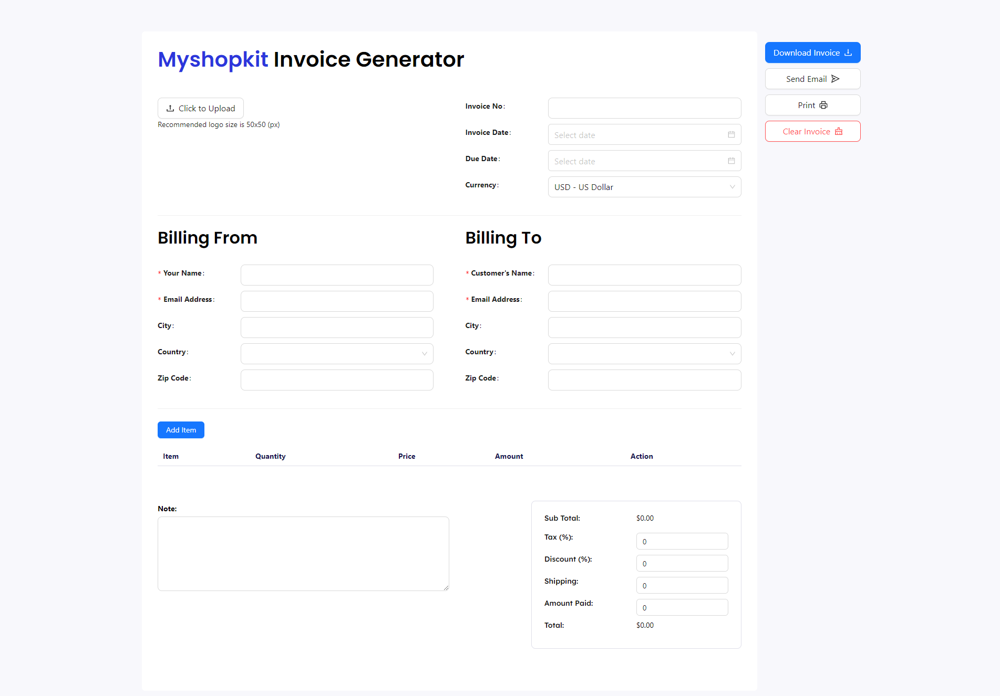
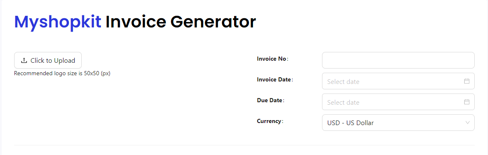
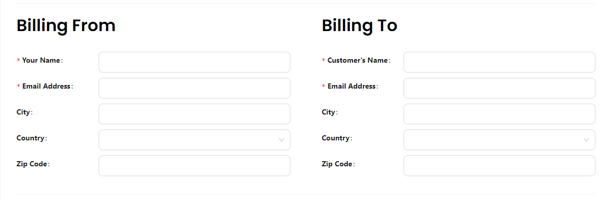
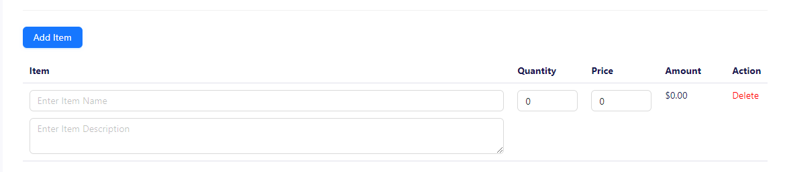
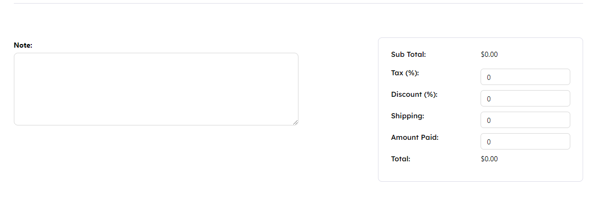

# UI tổng quan

  

Data type tương ứng
[File chứa type](../types.ts)

```ts
export interface ProductLine {
  id: string;
  name: string;
  description: string;
  quantity: number;
  price: number;
}

export interface Invoice {
  // 1. Invoice info
  logo: string;
  invoiceTitle: string;
  invoiceDate: string;
  invoiceDueDate: string;
  currency: string;

  // 2. Invoice Billing
  // Bill From
  yourName: string;
  yourEmail: string;
  yourAddress: string;
  yourCountry: string;
  yourZipCode: string;

  // Bill To
  clientName: string;
  clientEmail: string;
  clientAddress: string;
  clientCountry: string;
  clientZipCode: string;

  // 3. Invoice Product
  productLines: ProductLine[];

  // Invoice Tax
  notes: string;

  tax: number;
  discount: number;
  shipping: number;
  amountPaid: number;
}
```

## Từ UI ta chia UI ra làm 4 phần để quản lí

### 1. Invoice Info

[File chứa code](../components/InvoiceInfo.tsx)
Chứa thông tin cơ bản của hóa đơn, gồm các trường:

- Logo
- Mã hóa đơn
- Ngày hóa đơn
- Ngày đáo hạn
- Loại tiền tệ



### 2. Invoice Billing

[File chứa code](../components/InvoiceBilling.tsx)
Chứa thông tin thanh toán của người gửi và người nhận, gồm các trường:

- Người gửi:
  - Tên
  - Email
  - Địa chỉ người gửi
  - Quốc gia
  - Zip Code
- Người nhận:
  - Tên
  - Email
  - Địa chỉ người nhận
  - Quốc gia
  - Zip Code



### 3. Invoice Products

[File chứa code](../components/InvoiceProducts.tsx)
Chứa thông tin sản phẩm trong hóa đơn, 1 sản phẩm gồm các trường:

- Tên sản phẩm
- Mô tả sản phầm
- Số lượng
- Giá sản phẩm
- Thành tiền = Số lượng * giá



### 4. Invoice Total

[File chứa code](../components/InvoiceTax.tsx)
Chứa ghi chú của hóa đơn và tổng số tiền, gồm các trường

- Tổng số tiền của các sản phầm
- Ghi chú của hóa đơn
- Thuế tính theo phần trăm (%)
- Giảm giá tính theo phần trăm (%)
- Tiền ship
- Tiền đã trả trước
- Tổng tiền sau khi tính các trường trên


